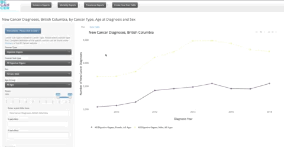

# Data tools and dashboards using BC Cancer Registry data

Using data from the BC Cancer Registry, BC Cancer produces data on cancer surveillance and outcomes in the BC health-care system. Several information products, data tools and interactive data visualization dashboards are available to support researchers and public health professionals. Please visit the [Disease & System Statistics website](http://www.bccancer.bc.ca/health-info/disease-system-statistics){target="_blank"} for more information.

## Cancer statistics online dashboard

We are excited to release the R Shiny app that enables users to explore BC cancer incidence, mortality, prevalence, and outcomes data by cancer types, sex, age, and year. Additionally, you can find age-standardized rates and trends, and standardized incidence and mortality ratios. The app allows users to create custom interactive plots and data tables. Data are available for download as well.

The app is live [here](https://bccandataanalytics.shinyapps.io/IncidenceCounts/){target="_blank"}.

## Cancer stage dashboards

There are three interactive dashboards available that provide detailed summary information on the distribution of stage of diagnosis and age-standardized incidence rates by sex and age at. Each of the three dashboards provides information for breast, cervix and colorectal cancers -- three cancer types in which BC Cancer operates organized cancer screening programs -- as well as for prostate cancer.

## Cancer projections data tables

This data table includes information on projected cancer incidence and between 2017 and 2032. Information is available by cancer site, sex and age group as well as various levels of geography. Data can be downloaded for further use.

## BC Cancer Tableau dashboard

In addition to the BC Cancer Statistics Online Dashboard, public health professionals affiliated with the Population Health Observatory can use the Tableau dashboard for an interactive and detailed summary of cancer incidence and mortality in BC since 1992 by sex, age cancer types and geography.

The dashboard is only available to researchers and health professionals upon request to [datareq\@bccancer.bc.ca](mailto:datareq@bccancer.bc.ca){.email}.
