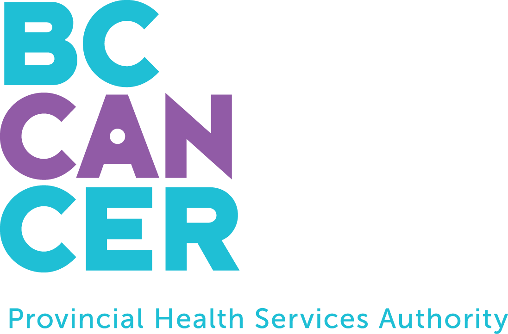

# About BC Cancer

```{r, include = F, eval=FALSE}
# .libPaths("C:/Users/jonathan.simkin1/Documents/R")
library(bookdown)
library(tidyverse)
library(rmarkdown)

# remotes::install_github("rstudio/bootstraplib")

# if (!requireNamespace('devtools')) install.packages('devtools')
# devtools::install_github('rstudio/bookdown')
```

<a href="http://www.bccancer.bc.ca/health-professionals/professional-resources/bc-cancer-registry" target="_blank">{align="right" style="margin: 0 1em 0 1em" width="250" height="150"}</a> BC Cancer, a program of the Provincial Health Services Authority, provides a comprehensive cancer control program for the people of BC in partnership with regional health authorities. This includes prevention, screening and early detection programs, research and education, and care and treatment.

BC Cancer's mission is to reduce the burden of cancer in British Columbia. For more on BC Cancer's mission and core value, please visit the <a href="http://www.bccancer.bc.ca/about/who-we-are" target="_blank">BC Cancer website</a>.

This report was prepared by BC Cancer's Data and Analytics team. This publication is available from the BC Cancer <a href="http://www.bccancer.bc.ca/health-professionals/professional-resources/bc-cancer-registry" target="_blank">website</a>.

<a href="http://www.bccancer.bc.ca/health-professionals/professional-resources/bc-cancer-registry" target="_blank">{alt="Cover image" align="right" style="margin: 0 1em 0 1em" width="250"}</a>

Material appearing in this publication may be reproduced or copied without permission; however, the following citation must be used to indicate the source:

Data and Analytics, BC Cancer. BC Cancer Registry Annual Report. Vancouver, BC: BC Cancer; 2022. [October, 2022]
